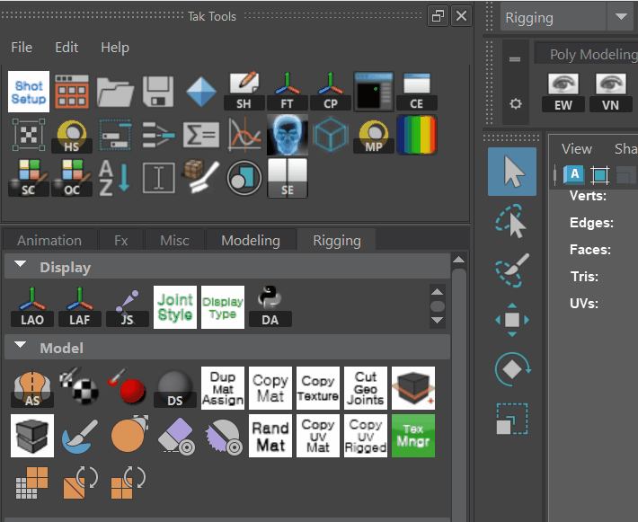

# takTools

A toolset module for the Autodesk Maya.
You can try use it. But all risk is yours.

> Test Environments
> * Windows 10
> * Maya 2020, 2022, 2024

## Install and Uninstall
Just drag and drop `install.py` file to the Maya viewport. During installation you can decide whether to install hotkeys and marking menu.

You can uninstall just delete a file `C:\Users\<UserName>\Documents\maya\modules\takTools.mod` and restart Maya.

## Features
### Shelf Icon

You can add a shelf icon with drag and drop. Because it is actually maya shelf.

But you have to save tools to keep shelf icons you add.

### Editor

You can edit the shelves with the editor that similar to Maya's native shelf editor.

### Marking Menu

You can use marking menu with Hotkey **Shift + 1~4**.
> - Shift + 1: Display Tools
> - Shift + 2: Selection Tools
> - Shift + 3: Rigging Tools
> - Shift + 4: Skinning Tools

## Notice
- Needs the **Git Install** for updating
- **Reordering shelf** only works in the **same task tab** for now
- Task shelf file name should be `Tab_Frame` form

## To Do
- Add preference GUI
- Polising the **Editor**: Add/Remove shelf, reorder shelf button
- Improve performance
